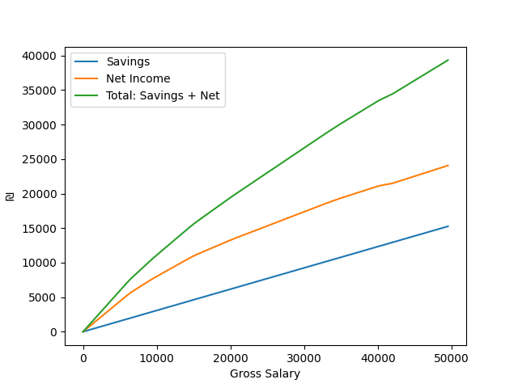

<!-- PROJECT SHIELDS -->
<!--
*** I'm using markdown "reference style" links for readability.
*** Reference links are enclosed in brackets [ ] instead of parentheses ( ).
*** See the bottom of this document for the declaration of the reference variables
*** for contributors-url, forks-url, etc. This is an optional, concise syntax you may use.
*** https://www.markdownguide.org/basic-syntax/#reference-style-links
-->
[![Contributors][contributors-shield]][contributors-url]
[![Forks][forks-shield]][forks-url]
[![Stargazers][stars-shield]][stars-url]
[![Issues][issues-shield]][issues-url]
[![MIT License][license-shield]][license-url]
[![LinkedIn][linkedin-shield]][linkedin-url]

<!-- PROJECT LOGO -->
 

  

<h3 align="center">Salary Calculator</h3>

  This app calculates all the payments made given a gross salary, 
  in order to know what to expect to see in a paycheck.
  

     
    <a href="https://github.com/dannissim/salary-calculator/issues">Report Bug</a>
    ·
    <a href="https://github.com/dannissim/salary-calculator/issues">Request Feature</a>
  

<!-- ABOUT THE PROJECT -->
## About The Project
Do you wonder where exactly your money goes, if you have a given gross salary?  
Many of the online resources are confusing, and many of the online calculators are too complicated to use.  
The aim of this project is to bridge those gaps. Below you can see all the details per gross salary, 
and in the source code and documentation you can learn what exactly happens to you gross salary.
  
(<a href="#top">back to top</a>)

### Built With

* [Python 3.10](https://python.org/)
* [Kol Zchut](https://www.kolzchut.org.il/he/%D7%A2%D7%9E%D7%95%D7%93_%D7%A8%D7%90%D7%A9%D7%99)

(<a href="#top">back to top</a>)

### Manual Usage

1. Create a virtual environment (optional):  
    a. `python -m venv venv`  
    b. `venv\Scripts\activate` or in linux `source venv/bin/activate`
2. Install the requirements: `pip install -r requirements.txt`
3. Run `python salary_calculator.py`

## Results

Updated to 2022 Tax Brackets. All the numbers are in Israeli Shekels ₪.

| Gross Salary        | Overall Income        | Net Income        | Overall Savings        | Taxable Income        | Income Tax        | Health Insurance        | Social Insurance        | Employee Pension        | Employer Pension        | Employee Education Fund        | Employer Education Fund        | Employer Severance        |
|---------------------|-----------------------|-------------------|------------------------|-----------------------|-------------------|-------------------------|-------------------------|-------------------------|-------------------------|--------------------------------|--------------------------------|---------------------------|
| <b>1000</b>         | <b>1188</b>           | <b>880</b>        | <b>308</b>             | 1000                  | 0                 | 31                      | 4                       | 60                      | 65                      | 25                             | 75                             | 83                        |
| <b>2000</b>         | <b>2376</b>           | <b>1760</b>       | <b>616</b>             | 2000                  | 0                 | 62                      | 8                       | 120                     | 130                     | 50                             | 150                            | 166                       |
| <b>3000</b>         | <b>3564</b>           | <b>2640</b>       | <b>924</b>             | 3000                  | 0                 | 93                      | 12                      | 180                     | 195                     | 75                             | 225                            | 249                       |
| <b>4000</b>         | <b>4753</b>           | <b>3520</b>       | <b>1233</b>            | 4000                  | 0                 | 124                     | 16                      | 240                     | 260                     | 100                            | 300                            | 333                       |
| <b>5000</b>         | <b>5941</b>           | <b>4400</b>       | <b>1541</b>            | 5000                  | 0                 | 155                     | 20                      | 300                     | 325                     | 125                            | 375                            | 416                       |
| <b>6000</b>         | <b>7129</b>           | <b>5280</b>       | <b>1849</b>            | 6000                  | 0                 | 186                     | 24                      | 360                     | 390                     | 150                            | 450                            | 499                       |
| <b>7000</b>         | <b>8187</b>           | <b>6029</b>       | <b>2158</b>            | 7000                  | 73                | 229                     | 72                      | 420                     | 455                     | 175                            | 525                            | 583                       |
| <b>8000</b>         | <b>9171</b>           | <b>6705</b>       | <b>2466</b>            | 8000                  | 192               | 279                     | 142                     | 480                     | 520                     | 200                            | 600                            | 666                       |
| <b>9000</b>         | <b>10155</b>          | <b>7381</b>       | <b>2774</b>            | 9000                  | 311               | 329                     | 212                     | 540                     | 585                     | 225                            | 675                            | 749                       |
| <b>10000</b>        | <b>11094</b>          | <b>8012</b>       | <b>3082</b>            | 10000                 | 475               | 379                     | 282                     | 600                     | 650                     | 250                            | 750                            | 833                       |
| <b>Gross Salary</b> | <b>Overall Income</b> | <b>Net Income</b> | <b>Overall Savings</b> | <b>Taxable Income</b> | <b>Income Tax</b> | <b>Health Insurance</b> | <b>Social Insurance</b> | <b>Employee Pension</b> | <b>Employer Pension</b> | <b>Employee Education Fund</b> | <b>Employer Education Fund</b> | <b>Employer Severance</b> |
| <b>11000</b>        | <b>12006</b>          | <b>8615</b>       | <b>3391</b>            | 11000                 | 667               | 429                     | 352                     | 660                     | 715                     | 275                            | 825                            | 916                       |
| <b>12000</b>        | <b>12909</b>          | <b>9210</b>       | <b>3699</b>            | 12000                 | 867               | 479                     | 422                     | 720                     | 780                     | 300                            | 900                            | 999                       |
| <b>13000</b>        | <b>13812</b>          | <b>9805</b>       | <b>4007</b>            | 13000                 | 1067              | 529                     | 492                     | 780                     | 845                     | 325                            | 975                            | 1082                      |
| <b>14000</b>        | <b>14716</b>          | <b>10400</b>      | <b>4316</b>            | 14000                 | 1267              | 579                     | 562                     | 840                     | 910                     | 350                            | 1050                           | 1166                      |
| <b>15000</b>        | <b>15601</b>          | <b>10977</b>      | <b>4624</b>            | 15000                 | 1485              | 629                     | 632                     | 900                     | 975                     | 375                            | 1125                           | 1249                      |
| <b>16000</b>        | <b>16385</b>          | <b>11453</b>      | <b>4932</b>            | 16021                 | 1801              | 680                     | 703                     | 960                     | 1040                    | 400                            | 1200                           | 1332                      |
| <b>17000</b>        | <b>17147</b>          | <b>11906</b>      | <b>5241</b>            | 17096                 | 2135              | 734                     | 778                     | 1020                    | 1105                    | 425                            | 1275                           | 1416                      |
| <b>18000</b>        | <b>17908</b>          | <b>12359</b>      | <b>5549</b>            | 18171                 | 2468              | 788                     | 854                     | 1080                    | 1170                    | 450                            | 1350                           | 1499                      |
| <b>19000</b>        | <b>18668</b>          | <b>12811</b>      | <b>5857</b>            | 19246                 | 2801              | 842                     | 929                     | 1140                    | 1235                    | 475                            | 1425                           | 1582                      |
| <b>20000</b>        | <b>19429</b>          | <b>13264</b>      | <b>6165</b>            | 20321                 | 3134              | 895                     | 1004                    | 1200                    | 1300                    | 500                            | 1500                           | 1666                      |
| <b>Gross Salary</b> | <b>Overall Income</b> | <b>Net Income</b> | <b>Overall Savings</b> | <b>Taxable Income</b> | <b>Income Tax</b> | <b>Health Insurance</b> | <b>Social Insurance</b> | <b>Employee Pension</b> | <b>Employer Pension</b> | <b>Employee Education Fund</b> | <b>Employer Education Fund</b> | <b>Employer Severance</b> |
| <b>21000</b>        | <b>20160</b>          | <b>13686</b>      | <b>6474</b>            | 21396                 | 3499              | 949                     | 1079                    | 1260                    | 1365                    | 525                            | 1575                           | 1749                      |
| <b>22000</b>        | <b>20878</b>          | <b>14096</b>      | <b>6782</b>            | 22471                 | 3875              | 1003                    | 1155                    | 1320                    | 1430                    | 550                            | 1650                           | 1832                      |
| <b>23000</b>        | <b>21595</b>          | <b>14505</b>      | <b>7090</b>            | 23546                 | 4251              | 1057                    | 1230                    | 1380                    | 1495                    | 575                            | 1725                           | 1915                      |
| <b>24000</b>        | <b>22314</b>          | <b>14915</b>      | <b>7399</b>            | 24621                 | 4627              | 1110                    | 1305                    | 1440                    | 1560                    | 600                            | 1800                           | 1999                      |
| <b>25000</b>        | <b>23032</b>          | <b>15325</b>      | <b>7707</b>            | 25696                 | 5004              | 1164                    | 1380                    | 1500                    | 1625                    | 625                            | 1875                           | 2082                      |
| <b>26000</b>        | <b>23750</b>          | <b>15735</b>      | <b>8015</b>            | 26771                 | 5380              | 1218                    | 1456                    | 1560                    | 1690                    | 650                            | 1950                           | 2165                      |
| <b>27000</b>        | <b>24468</b>          | <b>16144</b>      | <b>8324</b>            | 27846                 | 5756              | 1272                    | 1531                    | 1620                    | 1755                    | 675                            | 2025                           | 2249                      |
| <b>28000</b>        | <b>25186</b>          | <b>16554</b>      | <b>8632</b>            | 28921                 | 6132              | 1325                    | 1606                    | 1680                    | 1820                    | 700                            | 2100                           | 2332                      |
| <b>29000</b>        | <b>25904</b>          | <b>16964</b>      | <b>8940</b>            | 29996                 | 6509              | 1379                    | 1681                    | 1740                    | 1885                    | 725                            | 2175                           | 2415                      |
| <b>30000</b>        | <b>26622</b>          | <b>17374</b>      | <b>9248</b>            | 31071                 | 6885              | 1433                    | 1757                    | 1800                    | 1950                    | 750                            | 2250                           | 2499                      |
| <b>Gross Salary</b> | <b>Overall Income</b> | <b>Net Income</b> | <b>Overall Savings</b> | <b>Taxable Income</b> | <b>Income Tax</b> | <b>Health Insurance</b> | <b>Social Insurance</b> | <b>Employee Pension</b> | <b>Employer Pension</b> | <b>Employee Education Fund</b> | <b>Employer Education Fund</b> | <b>Employer Severance</b> |
| <b>31000</b>        | <b>27340</b>          | <b>17783</b>      | <b>9557</b>            | 32146                 | 7261              | 1487                    | 1832                    | 1860                    | 2015                    | 775                            | 2325                           | 2582                      |
| <b>32000</b>        | <b>28058</b>          | <b>18193</b>      | <b>9865</b>            | 33221                 | 7637              | 1540                    | 1907                    | 1920                    | 2080                    | 800                            | 2400                           | 2665                      |
| <b>33000</b>        | <b>28775</b>          | <b>18602</b>      | <b>10173</b>           | 34298                 | 8014              | 1594                    | 1983                    | 1980                    | 2145                    | 825                            | 2475                           | 2748                      |
| <b>34000</b>        | <b>29466</b>          | <b>18984</b>      | <b>10482</b>           | 35433                 | 8412              | 1651                    | 2062                    | 2040                    | 2210                    | 850                            | 2550                           | 2832                      |
| <b>35000</b>        | <b>30151</b>          | <b>19361</b>      | <b>10790</b>           | 36576                 | 8812              | 1708                    | 2142                    | 2100                    | 2275                    | 875                            | 2625                           | 2915                      |
| <b>36000</b>        | <b>30802</b>          | <b>19704</b>      | <b>11098</b>           | 37794                 | 9238              | 1769                    | 2227                    | 2160                    | 2340                    | 900                            | 2700                           | 2998                      |
| <b>37000</b>        | <b>31453</b>          | <b>20046</b>      | <b>11407</b>           | 39012                 | 9664              | 1830                    | 2312                    | 2220                    | 2405                    | 925                            | 2775                           | 3082                      |
| <b>38000</b>        | <b>32103</b>          | <b>20388</b>      | <b>11715</b>           | 40231                 | 10091             | 1891                    | 2398                    | 2280                    | 2470                    | 950                            | 2850                           | 3165                      |
| <b>39000</b>        | <b>32754</b>          | <b>20731</b>      | <b>12023</b>           | 41449                 | 10517             | 1952                    | 2483                    | 2340                    | 2535                    | 975                            | 2925                           | 3248                      |
| <b>40000</b>        | <b>33405</b>          | <b>21074</b>      | <b>12331</b>           | 42667                 | 10944             | 2013                    | 2568                    | 2400                    | 2600                    | 1000                           | 3000                           | 3332                      |
| <b>Gross Salary</b> | <b>Overall Income</b> | <b>Net Income</b> | <b>Overall Savings</b> | <b>Taxable Income</b> | <b>Income Tax</b> | <b>Health Insurance</b> | <b>Social Insurance</b> | <b>Employee Pension</b> | <b>Employer Pension</b> | <b>Employee Education Fund</b> | <b>Employer Education Fund</b> | <b>Employer Severance</b> |
| <b>41000</b>        | <b>33939</b>          | <b>21299</b>      | <b>12640</b>           | 43885                 | 11487             | 2073                    | 2654                    | 2460                    | 2665                    | 1025                           | 3075                           | 3415                      |
| <b>42000</b>        | <b>34446</b>          | <b>21498</b>      | <b>12948</b>           | 45104                 | 12060             | 2133                    | 2737                    | 2520                    | 2730                    | 1050                           | 3150                           | 3498                      |
| <b>43000</b>        | <b>35097</b>          | <b>21841</b>      | <b>13256</b>           | 46322                 | 12632             | 2133                    | 2737                    | 2580                    | 2795                    | 1075                           | 3225                           | 3581                      |
| <b>44000</b>        | <b>35748</b>          | <b>22183</b>      | <b>13565</b>           | 47540                 | 13205             | 2133                    | 2737                    | 2640                    | 2860                    | 1100                           | 3300                           | 3665                      |
| <b>45000</b>        | <b>36399</b>          | <b>22526</b>      | <b>13873</b>           | 48759                 | 13778             | 2133                    | 2737                    | 2700                    | 2925                    | 1125                           | 3375                           | 3748                      |
| <b>46000</b>        | <b>37049</b>          | <b>22868</b>      | <b>14181</b>           | 49977                 | 14350             | 2133                    | 2737                    | 2760                    | 2990                    | 1150                           | 3450                           | 3831                      |
| <b>47000</b>        | <b>37701</b>          | <b>23211</b>      | <b>14490</b>           | 51195                 | 14923             | 2133                    | 2737                    | 2820                    | 3055                    | 1175                           | 3525                           | 3915                      |
| <b>48000</b>        | <b>38351</b>          | <b>23553</b>      | <b>14798</b>           | 52414                 | 15495             | 2133                    | 2737                    | 2880                    | 3120                    | 1200                           | 3600                           | 3998                      |
| <b>49000</b>        | <b>39001</b>          | <b>23895</b>      | <b>15106</b>           | 53632                 | 16068             | 2133                    | 2737                    | 2940                    | 3185                    | 1225                           | 3675                           | 4081                      |
| <b>50000</b>        | <b>39652</b>          | <b>24238</b>      | <b>15414</b>           | 54850                 | 16640             | 2133                    | 2737                    | 3000                    | 3250                    | 1250                           | 3750                           | 4165                      |
| <b>Gross Salary</b> | <b>Overall Income</b> | <b>Net Income</b> | <b>Overall Savings</b> | <b>Taxable Income</b> | <b>Income Tax</b> | <b>Health Insurance</b> | <b>Social Insurance</b> | <b>Employee Pension</b> | <b>Employer Pension</b> | <b>Employee Education Fund</b> | <b>Employer Education Fund</b> | <b>Employer Severance</b> |
| <b>51000</b>        | <b>40279</b>          | <b>24556</b>      | <b>15723</b>           | 56068                 | 17237             | 2133                    | 2737                    | 3060                    | 3315                    | 1275                           | 3825                           | 4248                      |
| <b>52000</b>        | <b>40893</b>          | <b>24862</b>      | <b>16031</b>           | 57287                 | 17846             | 2133                    | 2737                    | 3120                    | 3380                    | 1300                           | 3900                           | 4331                      |
| <b>53000</b>        | <b>41507</b>          | <b>25168</b>      | <b>16339</b>           | 58505                 | 18455             | 2133                    | 2737                    | 3180                    | 3445                    | 1325                           | 3975                           | 4414                      |
| <b>54000</b>        | <b>42122</b>          | <b>25474</b>      | <b>16648</b>           | 59723                 | 19064             | 2133                    | 2737                    | 3240                    | 3510                    | 1350                           | 4050                           | 4498                      |
| <b>55000</b>        | <b>42735</b>          | <b>25779</b>      | <b>16956</b>           | 60942                 | 19674             | 2133                    | 2737                    | 3300                    | 3575                    | 1375                           | 4125                           | 4581                      |
| <b>56000</b>        | <b>43349</b>          | <b>26085</b>      | <b>17264</b>           | 62160                 | 20283             | 2133                    | 2737                    | 3360                    | 3640                    | 1400                           | 4200                           | 4664                      |
| <b>57000</b>        | <b>43964</b>          | <b>26391</b>      | <b>17573</b>           | 63378                 | 20892             | 2133                    | 2737                    | 3420                    | 3705                    | 1425                           | 4275                           | 4748                      |
| <b>58000</b>        | <b>44578</b>          | <b>26697</b>      | <b>17881</b>           | 64597                 | 21501             | 2133                    | 2737                    | 3480                    | 3770                    | 1450                           | 4350                           | 4831                      |
| <b>59000</b>        | <b>45192</b>          | <b>27003</b>      | <b>18189</b>           | 65815                 | 22110             | 2133                    | 2737                    | 3540                    | 3835                    | 1475                           | 4425                           | 4914                      |
| <b>60000</b>        | <b>45806</b>          | <b>27309</b>      | <b>18497</b>           | 67033                 | 22719             | 2133                    | 2737                    | 3600                    | 3900                    | 1500                           | 4500                           | 4998                      |
| <b>Gross Salary</b> | <b>Overall Income</b> | <b>Net Income</b> | <b>Overall Savings</b> | <b>Taxable Income</b> | <b>Income Tax</b> | <b>Health Insurance</b> | <b>Social Insurance</b> | <b>Employee Pension</b> | <b>Employer Pension</b> | <b>Employee Education Fund</b> | <b>Employer Education Fund</b> | <b>Employer Severance</b> |
| <b>61000</b>        | <b>46421</b>          | <b>27615</b>      | <b>18806</b>           | 68251                 | 23328             | 2133                    | 2737                    | 3660                    | 3965                    | 1525                           | 4575                           | 5081                      |
| <b>62000</b>        | <b>47034</b>          | <b>27920</b>      | <b>19114</b>           | 69470                 | 23938             | 2133                    | 2737                    | 3720                    | 4030                    | 1550                           | 4650                           | 5164                      |
| <b>63000</b>        | <b>47648</b>          | <b>28226</b>      | <b>19422</b>           | 70688                 | 24547             | 2133                    | 2737                    | 3780                    | 4095                    | 1575                           | 4725                           | 5247                      |
| <b>64000</b>        | <b>48263</b>          | <b>28532</b>      | <b>19731</b>           | 71906                 | 25156             | 2133                    | 2737                    | 3840                    | 4160                    | 1600                           | 4800                           | 5331                      |
| <b>65000</b>        | <b>48877</b>          | <b>28838</b>      | <b>20039</b>           | 73125                 | 25765             | 2133                    | 2737                    | 3900                    | 4225                    | 1625                           | 4875                           | 5414                      |
| <b>66000</b>        | <b>49491</b>          | <b>29144</b>      | <b>20347</b>           | 74343                 | 26374             | 2133                    | 2737                    | 3960                    | 4290                    | 1650                           | 4950                           | 5497                      |
| <b>67000</b>        | <b>50106</b>          | <b>29450</b>      | <b>20656</b>           | 75561                 | 26983             | 2133                    | 2737                    | 4020                    | 4355                    | 1675                           | 5025                           | 5581                      |
| <b>68000</b>        | <b>50719</b>          | <b>29755</b>      | <b>20964</b>           | 76780                 | 27593             | 2133                    | 2737                    | 4080                    | 4420                    | 1700                           | 5100                           | 5664                      |
| <b>69000</b>        | <b>51333</b>          | <b>30061</b>      | <b>21272</b>           | 77998                 | 28202             | 2133                    | 2737                    | 4140                    | 4485                    | 1725                           | 5175                           | 5747                      |
| <b>70000</b>        | <b>51947</b>          | <b>30367</b>      | <b>21580</b>           | 79216                 | 28811             | 2133                    | 2737                    | 4200                    | 4550                    | 1750                           | 5250                           | 5831                      |
| <b>Gross Salary</b> | <b>Overall Income</b> | <b>Net Income</b> | <b>Overall Savings</b> | <b>Taxable Income</b> | <b>Income Tax</b> | <b>Health Insurance</b> | <b>Social Insurance</b> | <b>Employee Pension</b> | <b>Employer Pension</b> | <b>Employee Education Fund</b> | <b>Employer Education Fund</b> | <b>Employer Severance</b> |
| <b>71000</b>        | <b>52562</b>          | <b>30673</b>      | <b>21889</b>           | 80434                 | 29420             | 2133                    | 2737                    | 4260                    | 4615                    | 1775                           | 5325                           | 5914                      |
| <b>72000</b>        | <b>53176</b>          | <b>30979</b>      | <b>22197</b>           | 81653                 | 30029             | 2133                    | 2737                    | 4320                    | 4680                    | 1800                           | 5400                           | 5997                      |
| <b>73000</b>        | <b>53790</b>          | <b>31285</b>      | <b>22505</b>           | 82871                 | 30638             | 2133                    | 2737                    | 4380                    | 4745                    | 1825                           | 5475                           | 6080                      |
| <b>74000</b>        | <b>54405</b>          | <b>31591</b>      | <b>22814</b>           | 84089                 | 31247             | 2133                    | 2737                    | 4440                    | 4810                    | 1850                           | 5550                           | 6164                      |
| <b>75000</b>        | <b>55018</b>          | <b>31896</b>      | <b>23122</b>           | 85308                 | 31857             | 2133                    | 2737                    | 4500                    | 4875                    | 1875                           | 5625                           | 6247                      |
| <b>76000</b>        | <b>55632</b>          | <b>32202</b>      | <b>23430</b>           | 86526                 | 32466             | 2133                    | 2737                    | 4560                    | 4940                    | 1900                           | 5700                           | 6330                      |
| <b>77000</b>        | <b>56247</b>          | <b>32508</b>      | <b>23739</b>           | 87744                 | 33075             | 2133                    | 2737                    | 4620                    | 5005                    | 1925                           | 5775                           | 6414                      |
| <b>78000</b>        | <b>56861</b>          | <b>32814</b>      | <b>24047</b>           | 88963                 | 33684             | 2133                    | 2737                    | 4680                    | 5070                    | 1950                           | 5850                           | 6497                      |
| <b>79000</b>        | <b>57475</b>          | <b>33120</b>      | <b>24355</b>           | 90181                 | 34293             | 2133                    | 2737                    | 4740                    | 5135                    | 1975                           | 5925                           | 6580                      |
| <b>80000</b>        | <b>58089</b>          | <b>33426</b>      | <b>24663</b>           | 91399                 | 34902             | 2133                    | 2737                    | 4800                    | 5200                    | 2000                           | 6000                           | 6664                      |
| <b>Gross Salary</b> | <b>Overall Income</b> | <b>Net Income</b> | <b>Overall Savings</b> | <b>Taxable Income</b> | <b>Income Tax</b> | <b>Health Insurance</b> | <b>Social Insurance</b> | <b>Employee Pension</b> | <b>Employer Pension</b> | <b>Employee Education Fund</b> | <b>Employer Education Fund</b> | <b>Employer Severance</b> |
| <b>81000</b>        | <b>58704</b>          | <b>33732</b>      | <b>24972</b>           | 92617                 | 35511             | 2133                    | 2737                    | 4860                    | 5265                    | 2025                           | 6075                           | 6747                      |
| <b>82000</b>        | <b>59317</b>          | <b>34037</b>      | <b>25280</b>           | 93836                 | 36121             | 2133                    | 2737                    | 4920                    | 5330                    | 2050                           | 6150                           | 6830                      |
| <b>83000</b>        | <b>59931</b>          | <b>34343</b>      | <b>25588</b>           | 95054                 | 36730             | 2133                    | 2737                    | 4980                    | 5395                    | 2075                           | 6225                           | 6913                      |
| <b>84000</b>        | <b>60546</b>          | <b>34649</b>      | <b>25897</b>           | 96272                 | 37339             | 2133                    | 2737                    | 5040                    | 5460                    | 2100                           | 6300                           | 6997                      |
| <b>85000</b>        | <b>61160</b>          | <b>34955</b>      | <b>26205</b>           | 97491                 | 37948             | 2133                    | 2737                    | 5100                    | 5525                    | 2125                           | 6375                           | 7080                      |
| <b>86000</b>        | <b>61774</b>          | <b>35261</b>      | <b>26513</b>           | 98709                 | 38557             | 2133                    | 2737                    | 5160                    | 5590                    | 2150                           | 6450                           | 7163                      |
| <b>87000</b>        | <b>62389</b>          | <b>35567</b>      | <b>26822</b>           | 99927                 | 39166             | 2133                    | 2737                    | 5220                    | 5655                    | 2175                           | 6525                           | 7247                      |
| <b>88000</b>        | <b>63002</b>          | <b>35872</b>      | <b>27130</b>           | 101146                | 39776             | 2133                    | 2737                    | 5280                    | 5720                    | 2200                           | 6600                           | 7330                      |
| <b>89000</b>        | <b>63616</b>          | <b>36178</b>      | <b>27438</b>           | 102364                | 40385             | 2133                    | 2737                    | 5340                    | 5785                    | 2225                           | 6675                           | 7413                      |
| <b>90000</b>        | <b>64230</b>          | <b>36484</b>      | <b>27746</b>           | 103582                | 40994             | 2133                    | 2737                    | 5400                    | 5850                    | 2250                           | 6750                           | 7497                      |
| <b>Gross Salary</b> | <b>Overall Income</b> | <b>Net Income</b> | <b>Overall Savings</b> | <b>Taxable Income</b> | <b>Income Tax</b> | <b>Health Insurance</b> | <b>Social Insurance</b> | <b>Employee Pension</b> | <b>Employer Pension</b> | <b>Employee Education Fund</b> | <b>Employer Education Fund</b> | <b>Employer Severance</b> |
| <b>91000</b>        | <b>64845</b>          | <b>36790</b>      | <b>28055</b>           | 104800                | 41603             | 2133                    | 2737                    | 5460                    | 5915                    | 2275                           | 6825                           | 7580                      |
| <b>92000</b>        | <b>65459</b>          | <b>37096</b>      | <b>28363</b>           | 106019                | 42212             | 2133                    | 2737                    | 5520                    | 5980                    | 2300                           | 6900                           | 7663                      |
| <b>93000</b>        | <b>66073</b>          | <b>37402</b>      | <b>28671</b>           | 107237                | 42821             | 2133                    | 2737                    | 5580                    | 6045                    | 2325                           | 6975                           | 7746                      |
| <b>94000</b>        | <b>66688</b>          | <b>37708</b>      | <b>28980</b>           | 108455                | 43430             | 2133                    | 2737                    | 5640                    | 6110                    | 2350                           | 7050                           | 7830                      |
| <b>95000</b>        | <b>67301</b>          | <b>38013</b>      | <b>29288</b>           | 109674                | 44040             | 2133                    | 2737                    | 5700                    | 6175                    | 2375                           | 7125                           | 7913                      |
| <b>96000</b>        | <b>67915</b>          | <b>38319</b>      | <b>29596</b>           | 110892                | 44649             | 2133                    | 2737                    | 5760                    | 6240                    | 2400                           | 7200                           | 7996                      |
| <b>97000</b>        | <b>68530</b>          | <b>38625</b>      | <b>29905</b>           | 112110                | 45258             | 2133                    | 2737                    | 5820                    | 6305                    | 2425                           | 7275                           | 8080                      |
| <b>98000</b>        | <b>69144</b>          | <b>38931</b>      | <b>30213</b>           | 113329                | 45867             | 2133                    | 2737                    | 5880                    | 6370                    | 2450                           | 7350                           | 8163                      |
| <b>99000</b>        | <b>69758</b>          | <b>39237</b>      | <b>30521</b>           | 114547                | 46476             | 2133                    | 2737                    | 5940                    | 6435                    | 2475                           | 7425                           | 8246                      |
| <b>100000</b>       | <b>70372</b>          | <b>39543</b>      | <b>30829</b>           | 115765                | 47085             | 2133                    | 2737                    | 6000                    | 6500                    | 2500                           | 7500                           | 8330                      |

### Relevant Documentation
* דמי ביטוח לאומי
  * [כל זכות](https://www.kolzchut.org.il/he/%D7%93%D7%9E%D7%99_%D7%91%D7%99%D7%98%D7%95%D7%97_%D7%9C%D7%90%D7%95%D7%9E%D7%99_%D7%9C%D7%A2%D7%95%D7%91%D7%93_%D7%A9%D7%9B%D7%99%D7%A8)
  * [המוסד לביטוח לאומי](https://www.btl.gov.il/Insurance/Rates/Pages/%D7%9C%D7%A2%D7%95%D7%91%D7%93%D7%99%D7%9D%20%D7%A9%D7%9B%D7%99%D7%A8%D7%99%D7%9D.aspx)
* דמי ביטוח בריאות
  * [כל זכות](https://www.kolzchut.org.il/he/%D7%AA%D7%A9%D7%9C%D7%95%D7%9D_%D7%93%D7%9E%D7%99_%D7%91%D7%99%D7%98%D7%95%D7%97_%D7%91%D7%A8%D7%99%D7%90%D7%95%D7%AA)
  * [המסוד לביטוח לאומי](https://www.btl.gov.il/Insurance/Health_Insurance/Pages/%D7%A9%D7%99%D7%A2%D7%95%D7%A8%D7%99%20%D7%93%D7%9E%D7%99%20%D7%91%D7%99%D7%98%D7%95%D7%97%20%D7%91%D7%A8%D7%99%D7%90%D7%95%D7%AA.aspx)
* נקודות זיכוי
  * [כל זכות](https://www.kolzchut.org.il/he/%D7%A0%D7%A7%D7%95%D7%93%D7%AA_%D7%96%D7%99%D7%9B%D7%95%D7%99)
  * [מחשבון נקודות זיכוי](https://secapp.taxes.gov.il/srsimulatorNZ/#/simulator)
* [מדרגות מס הכנסה](https://www.kolzchut.org.il/he/%D7%9E%D7%93%D7%A8%D7%92%D7%95%D7%AA_%D7%9E%D7%A1_%D7%94%D7%9B%D7%A0%D7%A1%D7%94)
* [ניכוי מס הכנסה מפיצויי פיטורים](https://www.kolzchut.org.il/he/%D7%A0%D7%99%D7%9B%D7%95%D7%99_%D7%9E%D7%A1_%D7%94%D7%9B%D7%A0%D7%A1%D7%94_%D7%9E%D7%A4%D7%99%D7%A6%D7%95%D7%99%D7%99_%D7%A4%D7%99%D7%98%D7%95%D7%A8%D7%99%D7%9D)
* [זיכוי ממס הכנסה בגין הפרשות לביטוח פנסיוני](https://www.kolzchut.org.il/he/%D7%96%D7%99%D7%9B%D7%95%D7%99_%D7%9E%D7%9E%D7%A1_%D7%94%D7%9B%D7%A0%D7%A1%D7%94_%D7%91%D7%92%D7%99%D7%9F_%D7%94%D7%A4%D7%A8%D7%A9%D7%95%D7%AA_%D7%9C%D7%91%D7%99%D7%98%D7%95%D7%97_%D7%A4%D7%A0%D7%A1%D7%99%D7%95%D7%A0%D7%99)
* [פטור ממס הכנסה על הפרשות המעסיק לביטוח פנסיוני ולביטוח אובדן כושר עבודה](https://www.kolzchut.org.il/he/%D7%A4%D7%98%D7%95%D7%A8_%D7%9E%D7%9E%D7%A1_%D7%94%D7%9B%D7%A0%D7%A1%D7%94_%D7%A2%D7%9C_%D7%94%D7%A4%D7%A8%D7%A9%D7%95%D7%AA_%D7%94%D7%9E%D7%A2%D7%A1%D7%99%D7%A7_%D7%9C%D7%91%D7%99%D7%98%D7%95%D7%97_%D7%A4%D7%A0%D7%A1%D7%99%D7%95%D7%A0%D7%99_%D7%95%D7%9C%D7%91%D7%99%D7%98%D7%95%D7%97_%D7%90%D7%95%D7%91%D7%93%D7%9F_%D7%9B%D7%95%D7%A9%D7%A8_%D7%A2%D7%91%D7%95%D7%93%D7%94)
* [פטור ממס הכנסה על הפרשות המעסיק לקרן השלתמות של העובד](https://www.kolzchut.org.il/he/%D7%A7%D7%A8%D7%9F_%D7%94%D7%A9%D7%AA%D7%9C%D7%9E%D7%95%D7%AA#.D7.A4.D7.98.D7.95.D7.A8_.D7.9E.D7.9E.D7.A1_.D7.94.D7.9B.D7.A0.D7.A1.D7.94)

### Notes
* Notice the difference between ניכוי ממס and זיכוי ממס. The difference is:
  * a. ניכוי ממס:  The relevant sum isn't included in the gross salary at all - so it also doesn't get taxed/ insurance isn't paid for this sum.
  * b. זיכוי ממס: This means that the regarded sum grants you a discount off the initial income tax. Ex: You are supposed to pay ₪1000 in income tax but you received a discount of ₪200, then you only need to pay ₪800.

<!-- CONTRIBUTING -->
## Contributing

Contributions are what make the open source community such an amazing place to learn, inspire, and create. Any contributions you make are **greatly appreciated**.

If you have a suggestion that would make this better, please fork the repo and create a pull request. You can also simply open an issue with the tag "enhancement".
Don't forget to give the project a star! Thanks again!

1. Fork the Project
2. Create your Feature Branch (`git checkout -b feature/amazing-feature`)
3. Commit your Changes (`git commit -m 'Add some amazing feature'`)
4. Push to the Branch (`git push origin feature/amazing-feature`)
5. Open a Pull Request

(<a href="#top">back to top</a>)

<!-- LICENSE -->
## License

Distributed under the MIT License. See [`LICENSE`](LICENSE) for more information.

(<a href="#top">back to top</a>)

<!-- CONTACT -->
## Contact

Dan Nissim - nissim.dan@gmail.com

Project Link: [https://github.com/dannissim/salary-calculator](https://github.com/dannissim/salary-calculator)

(<a href="#top">back to top</a>)

<!-- MARKDOWN LINKS & IMAGES -->
<!-- https://www.markdownguide.org/basic-syntax/#reference-style-links -->
[contributors-shield]: https://img.shields.io/github/contributors/dannissim/salary-calculator.svg?style=for-the-badge
[contributors-url]: https://github.com/dannissim/salary-calculator/graphs/contributors
[forks-shield]: https://img.shields.io/github/forks/dannissim/salary-calculator.svg?style=for-the-badge
[forks-url]: https://github.com/dannissim/salary-calculator/network/members
[stars-shield]: https://img.shields.io/github/stars/dannissim/salary-calculator.svg?style=for-the-badge
[stars-url]: https://github.com/dannissim/salary-calculator/stargazers
[issues-shield]: https://img.shields.io/github/issues/dannissim/salary-calculator.svg?style=for-the-badge
[issues-url]: https://github.com/dannissim/salary-calculator/issues
[license-shield]: https://img.shields.io/github/license/dannissim/salary-calculator.svg?style=for-the-badge
[license-url]: https://github.com/dannissim/salary-calculator/blob/main/LICENSE
[linkedin-shield]: https://img.shields.io/badge/-LinkedIn-black.svg?style=for-the-badge&logo=linkedin&colorB=555
[linkedin-url]: https://linkedin.com/in/dan-nissim-2558a785
[product-screenshot]: images/screenshot.png